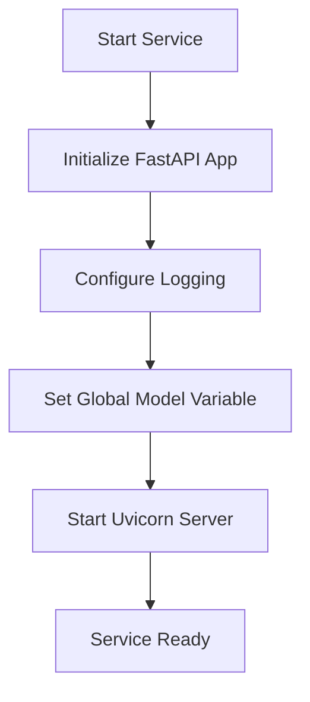
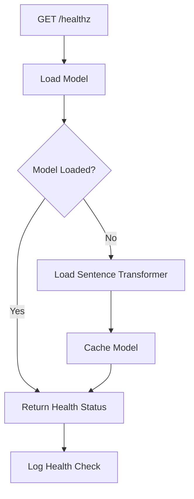
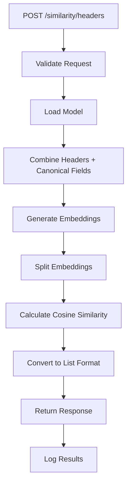

# Smart ETL Sidecar Documentation

## Overview

The ETL Sidecar is a Python-based microservice that provides semantic similarity calculations for the Smart-ETL pipeline. It uses sentence transformers to generate embeddings and calculate cosine similarity between headers and canonical fields, enabling intelligent header-to-field mapping.

## Table of Contents

1. [Architecture](#architecture)
2. [Features](#features)
3. [API Endpoints](#api-endpoints)
4. [Functional Flow](#functional-flow)
5. [Entry Routes](#entry-routes)
6. [Data Models](#data-models)
7. [Embeddings Process](#embeddings-process)
8. [Error Handling](#error-handling)
9. [Performance](#performance)
10. [Deployment](#deployment)
11. [Integration](#integration)
12. [Monitoring](#monitoring)

## Architecture

### System Design

```
┌─────────────────┐    HTTP/REST    ┌─────────────────┐
│   Smart ETL     │◄──────────────►│   ETL Sidecar   │
│   (Node.js)     │                 │   (Python)      │
│                 │                 │                 │
│ ┌─────────────┐ │                 │ ┌─────────────┐ │
│ │Embeddings   │ │                 │ │Sentence     │ │
│ │Client       │ │                 │ │Transformer  │ │
│ └─────────────┘ │                 │ └─────────────┘ │
└─────────────────┘                 │ ┌─────────────┐ │
                                     │ │Similarity   │ │
                                     │ │Calculator   │ │
                                     │ └─────────────┘ │
                                     └─────────────────┘
```

### Core Components

1. **FastAPI Application**: REST API framework
2. **Sentence Transformer**: `all-MiniLM-L6-v2` model for embeddings
3. **Similarity Calculator**: Cosine similarity computation
4. **Health Monitor**: Service health checking
5. **Logging System**: Structured logging for observability

## Features

### Core Functionality

- **Semantic Similarity**: Calculate semantic similarity between headers and canonical fields
- **Batch Processing**: Process multiple headers and fields in a single request
- **Model Caching**: Lazy loading and caching of the sentence transformer model
- **Health Monitoring**: Service health check with model status
- **Error Handling**: Comprehensive error handling and logging
- **Performance Optimization**: Efficient batch embedding computation

### Advanced Features

- **RESTful API**: Clean HTTP API with proper status codes
- **Type Safety**: Pydantic models for request/response validation
- **Async Support**: FastAPI async/await for better performance
- **JSON Serialization**: Efficient JSON response formatting
- **Logging**: Structured logging with different levels
- **Model Management**: Automatic model loading and initialization

## API Endpoints

### 1. Health Check Endpoint

```http
GET /healthz
```

**Purpose**: Check service health and model availability

**Response**:
```json
{
  "status": "ok",
  "model": "all-MiniLM-L6-v2",
  "service": "etl-sidecar"
}
```

**Error Response**:
```json
{
  "detail": "Service unhealthy: <error_message>"
}
```

### 2. Similarity Calculation Endpoint

```http
POST /similarity/headers
```

**Purpose**: Calculate semantic similarities between headers and canonical fields

**Request Body**:
```json
{
  "headers": ["customer_name", "email_address", "phone_number"],
  "canonicalFields": ["name", "email", "phone", "address"]
}
```

**Response**:
```json
{
  "model": "all-MiniLM-L6-v2",
  "similarities": [
    [0.95, 0.12, 0.88, 0.23],
    [0.15, 0.92, 0.18, 0.45],
    [0.22, 0.19, 0.89, 0.31]
  ]
}
```

### 3. Root Endpoint

```http
GET /
```

**Purpose**: Service information and available endpoints

**Response**:
```json
{
  "service": "ETL Sidecar - Embeddings Service",
  "version": "1.0.0",
  "endpoints": {
    "health": "/healthz",
    "similarity": "/similarity/headers"
  }
}
```

## Functional Flow

### 1. Service Initialization



### 2. Health Check Flow



### 3. Similarity Calculation Flow



### 4. Model Loading Flow

```mermaid
graph TD
    A[load_model()] --> B{Model Cached?}
    B -->|Yes| C[Return Cached Model]
    B -->|No| D[Load SentenceTransformer]
    D --> E[Initialize all-MiniLM-L6-v2]
    E --> F[Cache Model Globally]
    F --> G[Log Model Loaded]
    G --> C
```

## Entry Routes

### 1. Health Check Route

**Route**: `GET /healthz`
**Handler**: `health_check()`
**Purpose**: Service health monitoring

```python
@app.get("/healthz")
async def health_check():
    """Health check endpoint"""
    try:
        # Ensure model is loaded
        load_model()
        return {
            "status": "ok",
            "model": "all-MiniLM-L6-v2",
            "service": "etl-sidecar"
        }
    except Exception as e:
        logger.error(f"Health check failed: {e}")
        raise HTTPException(status_code=500, detail=f"Service unhealthy: {str(e)}")
```

**Flow**:
1. Call `load_model()` to ensure model is available
2. Return health status with model information
3. Handle exceptions and return 500 error if unhealthy

### 2. Similarity Calculation Route

**Route**: `POST /similarity/headers`
**Handler**: `calculate_similarities()`
**Purpose**: Calculate semantic similarities

```python
@app.post("/similarity/headers", response_model=SimilarityResponse)
async def calculate_similarities(request: SimilarityRequest):
    """Calculate semantic similarities between headers and canonical fields"""
    try:
        # Load model
        model = load_model()
        
        # Get embeddings for headers and canonical fields
        logger.info(f"Calculating similarities for {len(request.headers)} headers and {len(request.canonicalFields)} canonical fields")
        
        # Combine all texts for batch processing
        all_texts = request.headers + request.canonicalFields
        
        # Get embeddings for all texts
        embeddings = model.encode(all_texts)
        
        # Split embeddings back to headers and canonical fields
        header_embeddings = embeddings[:len(request.headers)]
        canonical_embeddings = embeddings[len(request.headers):]
        
        # Calculate similarity matrix
        similarities = cosine_similarity(header_embeddings, canonical_embeddings)
        
        # Convert to list of lists for JSON serialization
        similarities_list = similarities.tolist()
        
        logger.info(f"Successfully calculated {len(similarities_list)} x {len(similarities_list[0]) if similarities_list else 0} similarity matrix")
        
        return SimilarityResponse(
            model="all-MiniLM-L6-v2",
            similarities=similarities_list
        )
        
    except Exception as e:
        logger.error(f"Error calculating similarities: {e}")
        raise HTTPException(status_code=500, detail=f"Error calculating similarities: {str(e)}")
```

**Flow**:
1. Load the sentence transformer model
2. Combine headers and canonical fields for batch processing
3. Generate embeddings for all texts
4. Split embeddings back to headers and canonical fields
5. Calculate cosine similarity matrix
6. Convert numpy array to list format for JSON serialization
7. Return similarity matrix with model information

### 3. Root Route

**Route**: `GET /`
**Handler**: `root()`
**Purpose**: Service information

```python
@app.get("/")
async def root():
    """Root endpoint"""
    return {
        "service": "ETL Sidecar - Embeddings Service",
        "version": "1.0.0",
        "endpoints": {
            "health": "/healthz",
            "similarity": "/similarity/headers"
        }
    }
```

## Data Models

### 1. SimilarityRequest

```python
class SimilarityRequest(BaseModel):
    headers: List[str]
    canonicalFields: List[str]
```

**Fields**:
- `headers`: List of header names from the source file
- `canonicalFields`: List of canonical field names from the target entity

**Example**:
```json
{
  "headers": ["customer_name", "email_address", "phone_number"],
  "canonicalFields": ["name", "email", "phone", "address"]
}
```

### 2. SimilarityResponse

```python
class SimilarityResponse(BaseModel):
    model: str
    similarities: List[List[float]]
```

**Fields**:
- `model`: Name of the sentence transformer model used
- `similarities`: 2D matrix of similarity scores (headers × canonical fields)

**Example**:
```json
{
  "model": "all-MiniLM-L6-v2",
  "similarities": [
    [0.95, 0.12, 0.88, 0.23],
    [0.15, 0.92, 0.18, 0.45],
    [0.22, 0.19, 0.89, 0.31]
  ]
}
```

## Embeddings Process

### 1. Model Selection

**Model**: `all-MiniLM-L6-v2`
- **Type**: Sentence Transformer
- **Size**: ~80MB
- **Performance**: Balanced speed and accuracy
- **Use Case**: General-purpose semantic similarity

### 2. Embedding Generation

```python
# Combine all texts for batch processing
all_texts = request.headers + request.canonicalFields

# Get embeddings for all texts
embeddings = model.encode(all_texts)
```

**Process**:
1. Combine headers and canonical fields into single list
2. Use `model.encode()` for batch processing
3. Generate 384-dimensional embeddings for each text

### 3. Similarity Calculation

```python
# Split embeddings back to headers and canonical fields
header_embeddings = embeddings[:len(request.headers)]
canonical_embeddings = embeddings[len(request.headers):]

# Calculate similarity matrix
similarities = cosine_similarity(header_embeddings, canonical_embeddings)
```

**Process**:
1. Split embeddings back to headers and canonical fields
2. Calculate cosine similarity between all header-canonical pairs
3. Return similarity matrix (headers × canonical fields)

### 4. Similarity Matrix Interpretation

```
Headers:        [customer_name, email_address, phone_number]
Canonical:      [name,         email,         phone,         address]

Similarity Matrix:
                name    email   phone   address
customer_name   0.95    0.12    0.88    0.23
email_address   0.15    0.92    0.18    0.45
phone_number    0.22    0.19    0.89    0.31
```

**Interpretation**:
- `customer_name` → `name` (0.95): Very high similarity
- `email_address` → `email` (0.92): Very high similarity
- `phone_number` → `phone` (0.89): Very high similarity

## Error Handling

### 1. Health Check Errors

```python
except Exception as e:
    logger.error(f"Health check failed: {e}")
    raise HTTPException(status_code=500, detail=f"Service unhealthy: {str(e)}")
```

**Error Types**:
- Model loading failures
- Service initialization errors
- Resource unavailability

### 2. Similarity Calculation Errors

```python
except Exception as e:
    logger.error(f"Error calculating similarities: {e}")
    raise HTTPException(status_code=500, detail=f"Error calculating similarities: {str(e)}")
```

**Error Types**:
- Invalid request data
- Model encoding failures
- Memory allocation errors
- Similarity calculation failures

### 3. Error Response Format

```json
{
  "detail": "Error calculating similarities: <error_message>"
}
```

**HTTP Status Codes**:
- `200`: Success
- `422`: Validation error (invalid request format)
- `500`: Internal server error

## Performance

### 1. Model Loading

- **Lazy Loading**: Model loaded only when first requested
- **Caching**: Model cached globally after first load
- **Memory Usage**: ~80MB for model + embeddings

### 2. Batch Processing

- **Efficiency**: Process all texts in single batch
- **Memory Optimization**: Reuse embeddings for similarity calculation
- **Speed**: Batch processing faster than individual requests

### 3. Performance Characteristics

```python
# Performance metrics (approximate)
Model Loading:     ~2-3 seconds (first time)
Embedding Gen:    ~100ms per 100 texts
Similarity Calc:  ~50ms per 100x100 matrix
Total Request:    ~200ms for typical use case
```

### 4. Optimization Strategies

- **Batch Processing**: Combine all texts for single model.encode() call
- **Model Caching**: Load model once and reuse
- **Efficient Similarity**: Use scikit-learn's optimized cosine_similarity
- **Memory Management**: Process embeddings in chunks if needed

## Deployment

### 1. Local Development

```bash
# Create virtual environment
python3 -m venv .venv
source .venv/bin/activate

# Install dependencies
pip install -r requirements.txt

# Run service
uvicorn app:app --host 0.0.0.0 --port 3009
```

### 2. Docker Deployment

```dockerfile
FROM python:3.12-slim

WORKDIR /app

COPY requirements.txt .
RUN pip install -r requirements.txt

COPY app.py .

EXPOSE 3009

CMD ["uvicorn", "app:app", "--host", "0.0.0.0", "--port", "3009"]
```

### 3. Docker Compose

```yaml
version: '3.8'
services:
  etl-sidecar:
    build: .
    ports:
      - "3009:3009"
    environment:
      - MODEL_NAME=all-MiniLM-L6-v2
    healthcheck:
      test: ["CMD", "curl", "-f", "http://localhost:3009/healthz"]
      interval: 30s
      timeout: 10s
      retries: 3
```

### 4. Production Considerations

- **Resource Limits**: Minimum 1GB RAM for model loading
- **Health Checks**: Regular health check monitoring
- **Scaling**: Stateless service, can be horizontally scaled
- **Monitoring**: Log aggregation and metrics collection

## Integration

### 1. Smart ETL Integration

```typescript
// Node.js client integration
const response = await axios.post('http://etl-sidecar:3009/similarity/headers', {
  headers: ['customer_name', 'email_address'],
  canonicalFields: ['name', 'email', 'phone']
});

const similarities = response.data.similarities;
```

### 2. Request Flow

```
Smart ETL → HTTP Request → ETL Sidecar → Model Processing → Response
```

**Integration Points**:
- HTTP REST API communication
- JSON request/response format
- Error handling and retry logic
- Timeout and connection management

### 3. Fallback Strategy

```typescript
// Graceful fallback in Smart ETL
try {
  const similarities = await embeddingsClient.getEmbeddingSimilarities(headers, canonicalFields);
  return similarities;
} catch (error) {
  console.log('SMART-ETL[EMBED] fallback to heuristic mapping');
  return null; // Fall back to heuristic mapping
}
```

## Monitoring

### 1. Health Monitoring

```bash
# Health check
curl http://localhost:3009/healthz

# Expected response
{
  "status": "ok",
  "model": "all-MiniLM-L6-v2",
  "service": "etl-sidecar"
}
```

### 2. Logging

```python
# Log levels
logger.info("Model loaded successfully")
logger.info(f"Calculating similarities for {len(headers)} headers")
logger.error(f"Error calculating similarities: {e}")
```

**Log Types**:
- **INFO**: Service operations and model loading
- **ERROR**: Error conditions and failures
- **DEBUG**: Detailed processing information

### 3. Metrics (Planned)

```python
# Potential metrics to add
- request_count_total
- request_duration_seconds
- model_load_duration_seconds
- similarity_calculation_duration_seconds
- error_count_total
```

### 4. Performance Monitoring

**Key Metrics**:
- Response time per request
- Model loading time
- Memory usage
- Error rate
- Throughput (requests per second)

## Use Cases

### 1. Header Mapping Enhancement

**Scenario**: Improve header-to-field mapping accuracy
**Input**: Headers from CSV files, canonical fields from entity schema
**Output**: Similarity matrix for intelligent mapping

### 2. Data Quality Improvement

**Scenario**: Standardize field names across different data sources
**Input**: Various header formats, standardized field names
**Output**: Mapping suggestions for data standardization

### 3. Entity Detection Support

**Scenario**: Enhance entity detection with semantic understanding
**Input**: Headers and entity-specific field patterns
**Output**: Similarity scores for entity classification

### 4. Data Integration

**Scenario**: Map fields between different systems
**Input**: Source system headers, target system fields
**Output**: Mapping recommendations for data integration

## Troubleshooting

### 1. Common Issues

**Model Loading Failures**:
```bash
# Check model availability
curl http://localhost:3009/healthz

# Check logs
docker logs etl-sidecar
```

**Memory Issues**:
```bash
# Monitor memory usage
docker stats etl-sidecar

# Increase memory limits
docker run --memory=2g etl-sidecar
```

**Network Connectivity**:
```bash
# Test connectivity from Smart ETL
curl http://etl-sidecar:3009/healthz

# Check network configuration
docker network ls
```

### 2. Debug Commands

```bash
# Health check
curl -v http://localhost:3009/healthz

# Test similarity calculation
curl -X POST http://localhost:3009/similarity/headers \
  -H "Content-Type: application/json" \
  -d '{"headers":["name"],"canonicalFields":["customer_name"]}'

# Check service logs
docker logs -f etl-sidecar
```

### 3. Performance Debugging

```python
# Add timing logs
import time

start_time = time.time()
embeddings = model.encode(all_texts)
encoding_time = time.time() - start_time
logger.info(f"Embedding generation took {encoding_time:.2f} seconds")
```

## Future Enhancements

### 1. Planned Features

- **Model Caching**: Redis-based model caching for faster startup
- **Batch Optimization**: Improved batch processing for large datasets
- **Custom Models**: Support for domain-specific models
- **Metrics Integration**: Prometheus metrics for monitoring
- **Caching Layer**: Response caching for repeated requests

### 2. Performance Improvements

- **Async Processing**: Full async/await implementation
- **Memory Optimization**: Streaming processing for large datasets
- **GPU Support**: CUDA support for faster processing
- **Model Quantization**: Reduced model size for faster loading

### 3. Integration Enhancements

- **GraphQL Support**: GraphQL API for complex queries
- **WebSocket Support**: Real-time similarity calculations
- **Batch API**: Bulk similarity calculations
- **Model Management**: Dynamic model loading and switching

---

## Conclusion

The ETL Sidecar provides essential semantic similarity capabilities for the Smart-ETL pipeline, enabling intelligent header-to-field mapping through advanced NLP techniques. With its FastAPI-based architecture, efficient batch processing, and comprehensive error handling, it serves as a critical component in the Smart-ETL ecosystem.

The service is designed for production use with proper monitoring, health checks, and integration patterns, making it a reliable and scalable solution for semantic similarity calculations in data processing workflows.

